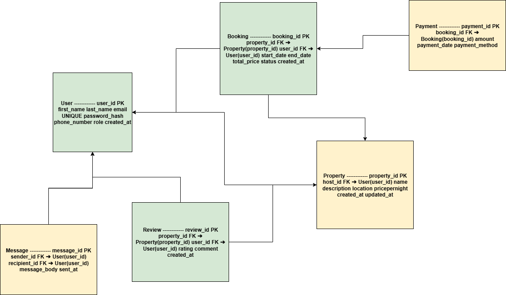

# Use Case Diagram — Airbnb Clone Backend

## 📄 Objective

This document provides a **use case diagram** that visualizes how users interact with the Airbnb Clone backend system.  
The diagram highlights the main actors and their interactions with key system functionalities.

## 🧑‍🤝‍🧑 Actors

- **Guest**
  - Registers and logs in
  - Searches and books properties
  - Makes payments
  - Sends and receives messages
  - Leaves reviews

- **Host**
  - Registers and logs in
  - Manages property listings
  - Communicates with guests
  - Views reviews

- **Admin**
  - Manages users and system-level operations

## 🖼️ Diagram

The diagram file is stored as:

## 🗂️ Directory Structure

## 📌 Notes

- The diagram was created using [Draw.io](https://app.diagrams.net/).
- The PNG can be regenerated by editing the `.drawio` source file if available.
- This diagram is based on the features and functionalities identified in Task 1 of the project.

